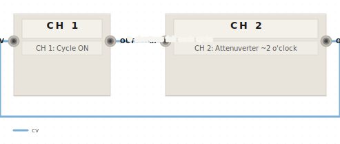
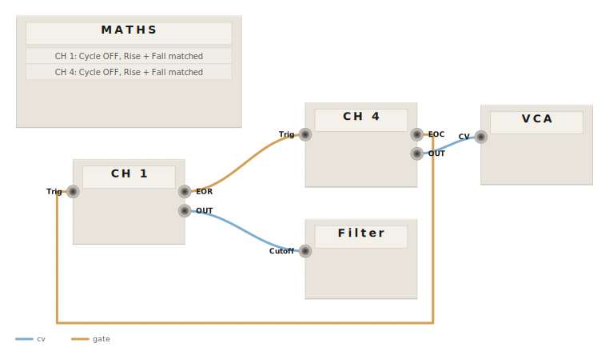
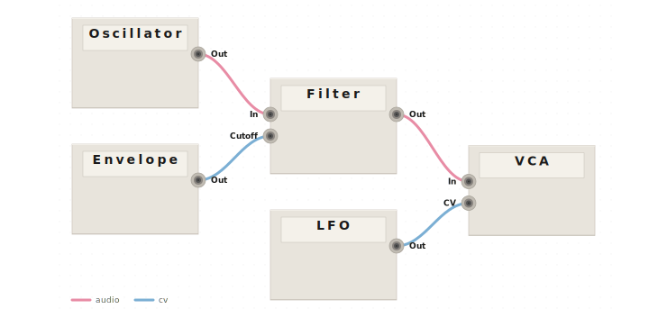
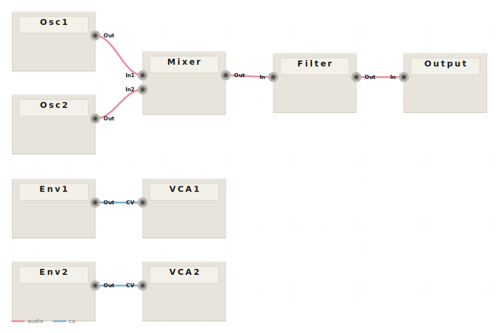

# patchflow

Eurorack patch diagram renderer. Patchbook-compatible notation to skeuomorphic SVG block diagrams.

## Examples

The diagrams below are regenerated on every push to `main` — they reflect the current output of the library.

### Bouncing ball (self-patching feedback)

```
MATHS:
* CH 1: Cycle ON
* CH 2: Attenuverter ~2 o'clock

- MATHS.CH 1 (OUT) >> MATHS.CH 2 (In)
- MATHS.CH 2 (Out) >> MATHS.CH 1 (Fall CV) // shortens fall each cycle
```



### Quadrature LFOs (multi-module with feedback)

```
MATHS:
* CH 1: Cycle OFF, Rise + Fall matched
* CH 4: Cycle OFF, Rise + Fall matched

- MATHS.CH 1 (EOR) g> MATHS.CH 4 (Trig)
- MATHS.CH 4 (EOC) g> MATHS.CH 1 (Trig)
- MATHS.CH 1 (OUT) >> Filter (Cutoff)
- MATHS.CH 4 (OUT) >> VCA (CV)
```



### Simple chain

```
- Oscillator (Out) -> Filter (In)
- Envelope (Out) >> Filter (Cutoff)
- Filter (Out) -> VCA (In)
- LFO (Out) >> VCA (CV)
```



### Multi-voice patch

```
VOICE 1:
- Osc1 (Out) -> Mixer (In1)
- Env1 (Out) >> VCA1 (CV)

VOICE 2:
- Osc2 (Out) -> Mixer (In2)
- Env2 (Out) >> VCA2 (CV)

- Mixer (Out) -> Filter (In)
- Filter (Out) -> Output (In)
```



## Install

```bash
npm install patchflow
```

## Usage

```ts
import { render } from 'patchflow';

const svg = render(`
MATHS:
* CH 1: Cycle ON
* CH 2: Attenuverter ~2 o'clock

- MATHS.CH 1 (OUT) >> MATHS.CH 2 (In)
- MATHS.CH 2 (Out) >> MATHS.CH 1 (Fall CV) // shortens fall each cycle
`);
```

## Signal Operators

| Operator | Signal Type |
|----------|-------------|
| `->` | Audio |
| `>>` | CV |
| `p>` | Pitch / 1V/oct |
| `g>` | Gate |
| `t>` | Trigger |
| `c>` | Clock |

## API

- `render(notation, options?)` — notation to SVG string
- `parse(notation)` — notation to PatchGraph
- `layout(graph, options?)` — PatchGraph to LayoutResult
- `renderSvg(layoutResult, theme)` — LayoutResult + Theme to SVG
- `createTheme(overrides)` — factory with deep partial merge

## License

MIT
